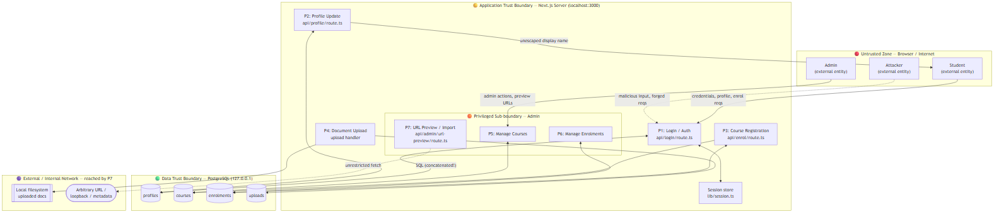
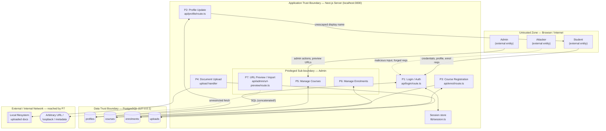

# Student Registration Web Application — Security Assessment & Hardening

| | |
|---|---|
| **Student name** | Abdulganiy Sodiq Abiodun |
| **Matriculation number** | 2021/1/84333CF |
| **Course** | IFT 542 — Web Security |
| **Date** | 1 August 2026 |

> **Scope and ethics.** All work was performed against a localhost-only teaching artefact
> (`http://127.0.0.1:3000`) built for this assessment. All data is fictitious. No third-party
> system was targeted at any point, and no reusable attack payload is submitted. The declaration
> is in `ETHICS.md`.

**Artefact.** A prototype university Student Registration portal — Next.js 14 (App Router),
TypeScript, PostgreSQL via `postgres.js`, custom cookie-session authentication. Six features:
student login, profile update, course registration, document upload, admin course management,
admin enrolment management. Thirteen vulnerabilities were deliberately planted in the baseline
(tag `v0-vulnerable`), modelled in Task 1, and remediated across Tasks 2 and 3.

**Result.** All thirteen findings are closed. The automated suite reports **183 passed, 1 skipped
(184 tests) across 11 files**, and `npm run build` compiles clean.

| Tag | State |
|---|---|
| `v0-vulnerable` | untouched baseline — the object of the Task 1 threat model |
| `v1-hardened-task2` | authentication and database findings fixed |
| `v2-hardened-task3` | application and configuration findings fixed, logging added |
| `v3-incident-response` | corrective controls, incident record, runbook |
| `v4-browser-fixes` | two browser-only defects fixed — **the submitted build** |

---

## Task 1 — STRIDE Threat Model and Risk Assessment

### 1.0 The baseline application

The threat model describes a working application, not a paper design. All six features are
recorded operating against the `v0-vulnerable` baseline:
`evidence/task1/01-login-student.png` and `evidence/task1/02-login-admin.png` (student and admin
login), `03-profile-update.png` (profile update), `04-course-register.png` (course registration),
`05-upload.png` (document upload), `06-admin-courses.png` (admin course management) and
`07-admin-enrolments.png` (admin enrolment management). The flat file-path index of every planted
defect, with its `// [VULN: …]` source marker, is `evidence/task1/planted-vulns.md`.

### 1.1 Data-flow diagram with trust boundaries



Five trust boundaries are marked: (1) browser ↔ server, (2) server ↔ database, (3) server ↔
external/internal network via the admin URL-preview feature, (4) server ↔ local filesystem, and
(5) a privilege sub-boundary separating ordinary from admin functions. The dotted flows are the
attacker's entry points. Processes P1–P7 correspond to real route handlers, so the model describes
this code rather than a generic web application.

### 1.2 STRIDE worksheet

Every threat is tied to a planted vulnerability with its file and line in the `v0-vulnerable`
baseline (commit `b42df0a`). Those line numbers are the historical record; current locations are
in Appendix A.

| # | STRIDE | Application-specific threat | Planted vulnerability (file : line) |
|---|--------|------------------------------|--------------------------------------|
| T1 | **S**poofing | Authenticate as any user (incl. admin) with no valid password by injecting into the login query | SQLi — `api/login/route.ts:46–54` |
| T2 | **T**ampering | Force a logged-in victim's browser to submit profile updates / enrolments via a forged cross-site request | No CSRF + no SameSite — `api/profile/route.ts:27`, `api/enrol/route.ts:23`, `lib/session.ts:60` |
| T3 | **T**ampering / EoP | Stored script in the display name executes in any viewer's (incl. admin's) session | Stored XSS — source `api/profile/route.ts:32`; sinks `dashboard/page.tsx:23`, `profile/page.tsx:25` |
| T4 | **R**epudiation | An admin (or attacker acting as admin) alters records; no tamper-evident log exists, so the action cannot be attributed or disproven | No security logging in baseline |
| T5 | **I**nfo. Disclosure | Whole-database password compromise — credentials stored and compared in cleartext, exfiltratable via T1 | Plaintext passwords — `001_init.sql:29`, `seed.sql:26–34`, compared `api/login/route.ts:50` |
| T6 | **I**nfo. Disclosure | Server-side request forgery reaches loopback / private / cloud-metadata addresses and returns internal responses | SSRF — `api/admin/url-preview/route.ts:27` |
| T7 | **I**nfo. Disclosure | Verbose SQL/stack errors and distinct "no account" vs "wrong password" replies leak schema and valid accounts | Verbose errors `api/login/route.ts:56`; enumeration `:86` |
| T8 | **D**enial of Service | Unthrottled login and unbounded upload allow flooding and unlimited brute force | No rate limiting `api/login/route.ts:28`; upload handler (no size cap) |
| T9 | **E**levation of Privilege | Ordinary user becomes admin via default admin credentials or a session forged with the committed secret | Default admin `lib/config.ts:26`, `seed.sql:8`; hardcoded secret `lib/config.ts:16`; fixation `lib/session.ts:35` |

All six STRIDE categories are covered — S:T1 · T:T2,T3 · R:T4 · I:T5,T6,T7 · D:T8 · E:T9.

### 1.3 Risk register (summary)

Likelihood (L) and Impact (I) are scored 1–5; **Risk = L × I**. Control types are marked
P (preventive), D (detective), C (corrective). The full register with every control listed per
threat is **Appendix A**.

| Rank | # | Threat | L | I | Risk | Priority | Residual |
|---|---|---|---|---|---|---|---|
| 1 | T1 | SQLi auth bypass | 5 | 5 | **25** | Critical | 1×5 = **5** |
| 2 | T9 | Default admin creds + hardcoded secret → EoP | 4 | 5 | **20** | Critical | 1×5 = **5** |
| 3 | T5 | Plaintext password disclosure | 4 | 5 | **20** | Critical | 2×3 = **6** |
| 4 | T3 | Stored XSS in display name | 4 | 4 | **16** | High | 1×4 = **4** |
| 5 | T2 | CSRF on profile / enrolment | 4 | 3 | **12** | High | 1×3 = **3** |
| 6 | T8 | Login/upload flooding & brute force | 4 | 3 | **12** | High | 2×3 = **6** |
| 7 | T4 | Unattributable admin/user actions | 4 | 3 | **12** | High | 2×2 = **4** |
| 8 | T6 | SSRF via admin URL preview | 3 | 4 | **12** | High | 1×3 = **3** |
| 9 | T7 | Verbose errors + user enumeration | 5 | 2 | **10** | Medium | 1×2 = **2** |

### 1.4 Justification of the top three risks

**#1 — T1, SQLi authentication bypass (25).** The single highest risk: unauthenticated, trivially
exploitable, and granting complete account takeover including the admin account, which collapses
every other control. Likelihood is maximal — the concatenated query accepts attacker-controlled
SQL directly — and impact is maximal. **Residual 5:** after parameterized binding, user input can
no longer alter query structure, so likelihood drops to 1; the residual reflects only the
possibility of an unrelated future injection elsewhere, which is monitored and accepted as low.

**#2 — T9, privilege escalation via default admin + hardcoded secret (20).** Any user who knows
the shipped default (`admin@campus.local / admin123`) or the committed session secret can reach
admin course and enrolment management — a full trust-boundary crossing. Likelihood is high because
both values are discoverable in source; impact is maximal. **Residual 5:** removing the default
account, forcing a strong per-deployment password, and moving the secret to an environment
variable makes guessing or forgery infeasible, dropping likelihood to 1. The remainder is generic
credential-theft risk, accepted as low.

**#3 — T5, plaintext password disclosure (20).** Credentials are stored and compared in cleartext
and are exfiltratable through T1, so one read compromises every account and any password reused
elsewhere. Likelihood is high given T1; impact is maximal. **Residual 6:** Argon2id hashing means
even a full database read yields only expensive-to-crack digests; the residual reflects offline
cracking of weak passwords, mitigated by a password policy and accepted as low.

---

## Task 2 — Secure Authentication and SQL Injection Remediation

### 2.1 The unsafe query

**File:** `src/app/api/login/route.ts`, lines 46–54 at tag `v0-vulnerable`.

```ts
const authQuery =
  "SELECT p.id, p.email, p.role, p.display_name " +
  "FROM profiles p " +
  "JOIN credentials c ON c.profile_id = p.id " +
  "WHERE p.email = '" + email + "' AND c.password = '" + password + "'";

let rows: any[];
try {
  rows = await sql.unsafe(authQuery);
```

**Why it is unsafe.** Two defects in five lines. First, `email` and `password` are concatenated
into the SQL string and executed with `sql.unsafe()`, so attacker input is parsed as *code*, not
data. Submitting `email = ' OR '1'='1' -- ` produces:

```sql
WHERE p.email = '' OR '1'='1' -- ' AND c.password = '...'
```

The `--` comments out the password check and the statement returns the first row — authentication
bypassed with no valid password, as the first account in the table, which in this schema is a
student but could as easily be the admin. Second, the password is compared in cleartext
(`c.password = '<password>'`) because `credentials.password` stored the raw value, so the same
query that authenticates also confirms that plaintext storage is in use.

### 2.2 The parameterized fix

**File:** `src/app/api/login/route.ts`, lines 84–92 at tag `v1-hardened-task2` and unchanged since.

```ts
let rows: AuthRow[];
try {
  rows = await sql<AuthRow[]>`
    SELECT p.id, p.email, p.role, p.display_name, c.password_hash
    FROM profiles p
    JOIN credentials c ON c.profile_id = p.id
    WHERE p.email = ${input.email}
    LIMIT 1
  `;
```

**How parameterization separates data from code.** This is a postgres.js *tagged template*, not a
string. The driver never assembles a single SQL text containing the input. It sends the statement
through PostgreSQL's extended query protocol: the query text, carrying a `$1` placeholder, goes in
a `Parse` message and is planned by the server *before* any value is supplied; the value travels
separately in a `Bind` message as a typed parameter. Because the parse and plan are complete
before the input arrives, no byte of user input can ever be interpreted as SQL syntax — quotes,
comment markers and semicolons in the input are just characters in a string literal.
`' OR '1'='1' -- ` is therefore compared as a literal email address, matches zero rows, and the
login fails. This is a structural guarantee, not a filter: there is no payload to escape and
nothing to keep a blocklist current against.

**Evidence: `evidence/task2/02-sqli-no-bypass.png`** records the payload `' OR '1'='1' -- `
submitted to `/api/login` against the hardened build and answered with `HTTP status: 401`,
`{"error":"Invalid email or password"}`, `Set-Cookie: []` and `[NO BYPASS]`. The full before/after
excerpt of the login query is `evidence/task2/login-query-before-after.md`; the transcripts either
side of the fix are `evidence/task2/run-output.txt` (baseline) and
`evidence/task2/run-output-after.txt` (hardened).

Three supporting changes came with it. The password left the SQL entirely — the query selects
`c.password_hash` and the comparison happens in application code. `LIMIT 1` reflects that email is
unique. And the second injectable query — a further concatenated lookup that existed only to
report *which* field was wrong — was deleted along with the enumeration oracle it provided.

### 2.3 Input validation and generic errors

`src/lib/validate.ts` enforces email format with 3–254 length bounds and password bounds of
8–128 characters, and rejects non-string values outright rather than coercing them with `String()`
— type confusion is how a JSON `{"email": {"$ne": null}}` becomes an authentication bypass in
other stacks. Validation is defence in depth here, not the injection fix: the parameterized query
is already safe without it.

Every failure path returns one byte-identical response:

```
401 {"error":"Invalid email or password"}
```

Unknown email, wrong password, malformed input and locked account are indistinguishable to the
client. Driver messages, stack traces and raw SQL are logged server-side only; the login page no
longer renders a `stack` or `query` block, which the baseline did.

Timing was equalised too. `verifyPassword()` in `src/lib/password.ts` always performs exactly one
Argon2id verification — against a memoised decoy digest when the account does not exist — so an
unknown email costs the same ~35 ms as a known email with a wrong password. Without this, the
generic error message would be undone by a ~2 ms versus ~35 ms step function that leaks precisely
what the message was introduced to hide. The decoy can never authenticate: the result is gated on
`digest !== null`.

### 2.4 Argon2id password storage

`src/lib/password.ts` is the only module that imports `argon2`. Parameters are passed explicitly
rather than inherited from the library defaults, so the work factor is auditable straight from the
stored digest:

```ts
export const ARGON2_OPTIONS = {
  type: argon2id,
  memoryCost: 19456, // KiB => 19 MiB
  timeCost: 2,       // iterations
  parallelism: 1,    // lanes
  hashLength: 32,    // bytes of output
} as const;
```

These are the OWASP Password Storage Cheat Sheet minimums for Argon2id. A fresh 16-byte random
salt per hash means two users with the same password still get different digests. The stored form
is the standard PHC string, `$argon2id$v=19$m=19456,p=1,t=2$<salt>$<digest>`.

The fix is enforced at the database level, not merely in application code:

```sql
password_hash TEXT NOT NULL
CONSTRAINT credentials_password_hash_argon2id CHECK (password_hash LIKE '$argon2id$%')
```

The plaintext `password` column is dropped. **Evidence: `evidence/task2/01-argon2id-hashes.png`**
shows all seven rows carrying the `$argon2id$v=19$m=19456,p=1,t=2$` prefix with visibly different
salts, alongside `\d credentials` proving the plaintext column is gone and the CHECK constraint is
present. `npm run db:reset:legacy` stages the exact v0 plaintext credentials and re-hashes them,
demonstrating the migration end to end; the default `npm run db:reset` never writes plaintext at
any instant.

### 2.5 The four additional controls

| Control | Implementation |
|---|---|
| **Rate limiting** | `src/lib/rate-limit.ts` — 5 failed attempts per IP per 60 s, then `429` + `Retry-After`. Failures only are counted and a success clears the bucket, so a user who mistypes twice then succeeds is never punished. Checked *before* any database or hashing work, so the limiter cannot itself be used to force expensive Argon2 computations. Per-IP rather than per-account deliberately: per-account bucketing is a lockout denial-of-service vector against a known user. |
| **Session-ID regeneration** | `src/lib/session.ts` — a fresh `randomUUID()` on every successful login, and the presented id is **deleted**, not re-pointed. This closes session fixation: an id an attacker planted before authentication does not survive the authentication boundary. |
| **Input validation** | `src/lib/validate.ts` — format and length bounds, no type coercion (§2.3). |
| **Generic error handling** | One `401` body for every failure mode, with verbose detail server-side only (§2.3). |

### 2.6 Test results

**Evidence: `evidence/task2/03-tests-green.png`** records the suite as it stood when Task 2 closed
at tag `v1-hardened-task2` — `Test Files 5 passed (5)`, `Tests 54 passed (54)`, the five Task 2
files below. The submitted build carries the Task 3 files as well and reports
`183 passed | 1 skipped (184)` across 11 files; that figure is recorded in
`evidence/task3/08-tests-green.png` and itemised in **Appendix B**.

The Task 2 files assert the four required proofs plus the two extra controls. Test counts are those
of the submitted build:

| Test file | Tests | Key assertion |
|---|---|---|
| `auth-login.test.ts` | 19 | Valid student and admin logins issue a `sid` cookie; every failure mode returns one byte-identical generic 401; the retired `admin123` is rejected |
| `sqli-parameterized.test.ts` | 11 | Injection strings bind as **data** — generic 401, no session issued, zero rows matched, tables intact, and no `sql.unsafe` remains in the handler |
| `password-storage.test.ts` | 13 | Every stored value starts `$argon2id$` with per-row salts and the documented work factor; no stored value equals or contains a known plaintext |
| `rate-limit.test.ts` | 7 | 5 failures per IP per 60 s then `429`; per-IP not global; a *correct* password is still refused once throttled |
| `session-regeneration.test.ts` | 5 | A presented `sid` is replaced **and deleted**; malformed cookies do not 500 |

The SQLi test deliberately proves more than a 401 — input validation alone would produce that. It
re-runs the payload as a bound parameter and asserts it matches zero rows, so the claim is about
the *query*, not the response code.

---

## Task 3 — Web Defences, Incident Response and Ethics

### 3.1 Stored XSS — contextual output encoding and CSP

Both `dangerouslySetInnerHTML` sinks now render `{user.display_name}` as a JSX text node, which
React escapes on output. **Input filtering was deliberately not used.** The payload is still stored
in the database verbatim; only the rendering is inert. That distinction is the whole point:
showing only escaped output would look identical if the application had silently stripped the
input, which is the weaker control and breaks legitimate values like `O'Brien`.

**Evidence: `evidence/task3/01-xss-neutralised.png`** shows both halves — `/dashboard`
displaying `` as literal text with no alert firing,
and the psql query proving the row still holds the payload intact.

Behind that sits a Content-Security-Policy with a per-request nonce, built in
`src/lib/security-headers.ts` and applied by `src/middleware.ts`. In production it carries no
`unsafe-inline` and no `unsafe-eval`; development relaxes it only for webpack HMR. The nonce
matters because Next streams its React Server Component payload through inline `<script>` tags —
a nonce-less strict policy would break the application, so the nonce must reach Next's bootstrap
scripts, and `security-headers.test.ts` asserts that it does and that it differs per request.

### 3.2 CSRF — signed double-submit tokens and SameSite

Three independent layers protect the seven authenticated POSTs:

| Layer | Control | A forged cross-site request gets |
|---|---|---|
| 1 | `SameSite=Lax` on the session cookie | cookie never sent → `303 /login`, anonymous |
| 2 | Origin / Referer check | `403` — `Origin: null` refused even with a valid cookie and token |
| 3 | Signed double-submit token | `403` — missing or tampered token refused |

The token is `<session-id>.HMAC-SHA256(SESSION_SECRET, session-id)`, verified with
`crypto.subtle.verify` for constant-time comparison (`src/lib/csrf.ts`). Binding it to the session
id is what stops an attacker minting a token from their own session and replaying it against a
victim's. `/api/login` is origin-checked but token-exempt, being pre-session by definition.

**Evidence: `evidence/task3/02-csrf-rejected.png`** shows layer 1 as a browser experiences it —
the POST to `/api/profile` returning `303 → /login` with `/dashboard` still showing the real
display name. A browser cannot demonstrate layers 2 and 3, because it is stopped by `SameSite`
first; `evidence/task3/03-csrf-rejected-layers.png` shows those two failing on their own from a Node
client, which does not implement `SameSite` — `403` with `csrf.rejected reason:"bad-origin"`,
`403` with `reason:"missing-token"`, a tampered signature also `403`, the legitimate control
request accepted as `303 /profile?saved=1`, and the database read proving no forged write landed.
`npx vitest run tests/csrf.test.ts` drives the same five steps.

The session cookie carries `HttpOnly; SameSite=Lax; Secure` (`src/lib/session.ts`). `Lax` rather
than `Strict` is deliberate — `Strict` would drop the session on every inbound link into the app,
making users appear logged out, while `Lax` already blocks the cross-site POST that CSRF requires.
**Evidence: `evidence/task3/04-cookie-flags.png`** shows the devtools cookie row with HttpOnly,
Secure and SameSite=Lax all set; the values are blurred, the flags are not. This is also the only
proof that `Secure` is accepted over `http://127.0.0.1` — browsers treat loopback as a potentially
trustworthy origin, but that is worth confirming rather than assuming.

### 3.3 SSRF — destination guarding

`src/lib/url-guard.ts` applies a scheme allowlist, a host allowlist, DNS resolution with
loopback / RFC1918 / link-local / reserved / IPv4-mapped-IPv6 rejection, per-hop redirect
re-validation, a 5-second timeout and a 64 KB response cap. An IP literal is classified directly
without reaching DNS.

Every blocked response is byte-identical — `403 {"ok":false,"error":"URL not allowed"}`. A
distinct reason per rejection would let an admin map the internal network by reading the error
messages, converting the guard into the disclosure oracle it exists to prevent.

**Evidence: `evidence/task3/05-ssrf-blocked.png`.** `ssrf-guard.test.ts` covers the full matrix
offline through an injected resolver — loopback, `localhost`, `169.254.169.254`, 10/8, the
172.16/12 boundary, 192.168/16, `file://`, `[::1]` and non-allowlisted hosts.

**Residual, stated honestly:** a DNS-rebinding TOCTOU window remains between our `lookup()` and
undici's `connect()`. Pinning the resolved IP through a custom undici `Agent` would close it.

### 3.4 Security misconfiguration and headers

`src/lib/config.ts` now fails closed throughout. `DEBUG` is opt-**in** (`process.env.DEBUG ===
"true"`); it previously defaulted to true and only the exact string `"false"` disabled it, so
`DEBUG=0`, `DEBUG=off` and production all left verbose errors on. `sessionSecret()` throws in
production when unset, with no committed fallback — and the secret is no longer dead code, since
it is the HMAC key for the CSRF tokens, which is what makes that fix load-bearing rather than
cosmetic. `DEFAULT_ADMIN` is deleted and `productionBrowserSourceMaps` is `false`.

The default admin password was rotated off `admin123` to the `ADMIN_PASSWORD` environment
variable with a strong documented fallback, read lazily so `.env` load ordering cannot silently
ignore it. `auth-login.test.ts` asserts `admin123` now returns 401.

**Evidence: `evidence/task3/06-security-headers.png`** shows the production response headers:

```
content-security-policy: default-src 'self'; script-src 'self' 'nonce-…'; style-src 'self';
  img-src 'self' data:; font-src 'self'; connect-src 'self'; object-src 'none'; base-uri 'self';
  form-action 'self'; frame-ancestors 'none'; upgrade-insecure-requests
strict-transport-security: max-age=63072000; includeSubDomains
x-content-type-options: nosniff
x-frame-options: DENY
referrer-policy: same-origin
permissions-policy: camera=(), microphone=(), geolocation=(), interest-cohort=()
```

All were absent in the baseline. The screenshot is of a production build (`npm run build &&
npm start`), which is the only build the strict policy applies to — `npm run dev` relaxes it for
webpack HMR, so the absence of any `unsafe-` or `ws:` token in the frame is itself the proof that
the production policy is the one shown. HSTS is inert over plain HTTP on localhost and is not
claimed as an active control here.

`Referrer-Policy` is `same-origin` rather than `no-referrer` for a reason discovered in testing:
`no-referrer` made browsers send `Origin: null` on plain form POSTs, which the CSRF Origin check
correctly rejected — so profile save, enrol, upload and both admin forms returned 403 in a real
browser while the whole test suite stayed green, because Node's `fetch` sets `Origin` explicitly
and does not implement `Referrer-Policy` at all. Dependency status is in **Appendix D**.

### 3.5 Security logging

`src/lib/logger.ts` emits structured JSON Lines carrying who, what and when: `ts`, `level`,
`event`, `actor` (`profile_id` + `role`, or `type:"anonymous"`), `ip`, `method`, `path`, `outcome`
and `reason`. The three required event types are `auth.login.failed`, `authz.denied` and
`validation.rejected`; `csrf.rejected` and `ssrf.blocked` are also emitted.

Redaction is enforced **inside the logger**, not at each call site: emails are masked to
`a***@campus.local` and a deny-list drops password-, hash-, token-, session- and secret-shaped
fields even when a caller passes them explicitly. Putting the control at the boundary means a
future call site cannot leak by forgetting to redact.

Delivering `authz.denied` required a code change beyond logging: `currentAdmin()` previously
returned `null` for both anonymous and authenticated-non-admin callers, discarding the one case
worth alerting on — an authenticated user probing an admin endpoint after account takeover.

**Evidence: `evidence/task3/07-security-logs.png`** shows the three event types appearing live in
the server's stdout with emails masked.

### 3.6 Incident response

The risk register promised four **corrective** controls that neither hardening task had built. They
are now runnable commands, and `report/incident-runbook.md` is the one-page six-stage runbook —
Preparation, Identification, Containment, Eradication, Recovery, Lessons Learned.

| Threat | Control | Command |
|---|---|---|
| T1 | Session revocation — ends access the patch cannot | `npm run ir:revoke-sessions` |
| T9 | Secret rotation — new passwords and `SESSION_SECRET` | `npm run ir:rotate-secrets` |
| T5 | Forced credential reset — locks accounts *and* revokes their sessions | `npm run ir:force-reset` |
| T4 | Append-only audit retention | `npm run ir:audit-log -- --verify` |

Every command defaults to a **dry run**; `--yes` plus `--incident <id>` is required to change
anything, and exactly one scope (`--all` / `--email` / `--role`) is mandatory, so no response
action is anonymous or accidentally global. Each mutation appends its own `ir.*` record, so the
response is audited by the control it administers.

Two design points carry most of the weight. **Revocation is a separate action from patching:**
in the simulated incident `INC-2026-001`, parameterizing the login query stopped new bypasses but
the session already issued stayed valid for a further 24 hours. **The forced reset is not an
oracle:** a locked account presenting the *correct* password returns a reply byte-identical to a
wrong password and to a non-existent account — same status, same body, no `Set-Cookie`, same
timing. The distinction exists only in the server log, as `auth.login.blocked`.

Append-only retention is enforced by **statement-level** triggers on `security_events`, which
refuse UPDATE, DELETE and TRUNCATE with SQLSTATE `42501`. A `DELETE` matching zero rows is refused
too — the case that distinguishes a statement-level trigger from a row-level one, since a
row-level `BEFORE DELETE` never fires when nothing matches and the control would be bypassable
with `WHERE id = -1`. The full incident record is **Appendix C**.

### 3.7 Ethics

The declaration is in `ETHICS.md` and covers ten clauses: authorisation, containment,
fictitious data, no third-party impact, no real secrets, honesty of evidence, the simulated nature
of the incident record, responsible handling, responsible disclosure, and own work.

Three commitments are worth restating here. **Localhost only** — the application and its database
bound to `127.0.0.1` throughout and were never deployed, port-forwarded or tunnelled.
**Fictitious data only** — every name is invented and every address uses the non-routable
`@campus.local` domain; no real personal data was entered at any point. **No reusable payloads** —
the standalone proof-of-concept scripts written against the vulnerable baseline were deleted
before submission; their coverage lives in the Vitest suite, which asserts that each control
*holds* rather than providing tooling that could be pointed at another system.

Two further points are recorded rather than glossed. `report/incident-record.md` documents
`INC-2026-001` in the form of a real incident report and carries a banner saying it is a
simulation, so it cannot be mistaken for a genuine breach if read out of context. And where a
control is incomplete — the SSRF TOCTOU window, the missing upload size cap, the absence of
alerting, the append-only trigger living inside the database it protects — the limitation is
documented rather than concealed.

---

## Appendices

*(Excluded from the main page count.)*

### Appendix A — Full risk register and OWASP mapping

Full register with all controls per threat, control types marked P (preventive), D (detective),
C (corrective):

| Rank | # | STRIDE | Threat | L | I | Risk | Priority | Controls | Residual |
|------|----|--------|--------|---|---|------|----------|--------|----------|
| 1 | T1 | S | SQLi auth bypass | 5 | 5 | **25** | Critical | Parameterized queries **(P)**; input validation **(P)**; log rejected/anomalous queries **(D)**; session revocation + runbook **(C)** | 1×5 = **5** |
| 2 | T9 | E | Default admin creds + hardcoded secret → EoP | 4 | 5 | **20** | Critical | Remove default account, force strong seeded password, secret to env + rotate **(P)**; MFA for admin **(P)**; log denied-authorization **(D)**; invalidate sessions on leak **(C)** | 1×5 = **5** |
| 3 | T5 | I | Plaintext password disclosure (via DB read / T1) | 4 | 5 | **20** | Critical | Argon2id hashing, never return plaintext **(P)**; monitor bulk DB reads **(D)**; forced reset on suspected breach **(C)** | 2×3 = **6** |
| 4 | T3 | T/E | Stored XSS in display name | 4 | 4 | **16** | High | Contextual output encoding + restrictive CSP **(P)**; CSP report-uri **(D)** | 1×4 = **4** |
| 5 | T2 | T | CSRF on profile / enrolment | 4 | 3 | **12** | High | Anti-CSRF token + SameSite cookie **(P)** | 1×3 = **3** |
| 6 | T8 | D | Login/upload flooding & brute force | 4 | 3 | **12** | High | Rate limiting + temporary lockout + upload size cap **(P)**; alert on repeated failures **(D)** | 2×3 = **6** |
| 7 | T4 | R | Unattributable admin/user actions | 4 | 3 | **12** | High | Structured who/what/when audit logs **(D)**; append-only retention **(C)** | 2×2 = **4** |
| 8 | T6 | I | SSRF via admin URL preview | 3 | 4 | **12** | High | Destination allowlist; reject loopback/private/metadata; re-check after DNS **(P)** | 1×3 = **3** |
| 9 | T7 | I | Verbose errors + user enumeration | 5 | 2 | **10** | Medium | Generic errors, debug off **(P)**; monitor error rates **(D)** | 1×2 = **2** |

#### OWASP Top 10 (2021) mapping

| Planted vulnerability | File : line (`v0-vulnerable`) | STRIDE | Risk # | OWASP 2021 |
|---|---|---|---|---|
| SQL injection in login (concatenated `sql.unsafe`) | `api/login/route.ts:46–54` | T1 | 1 | A03 Injection |
| Plaintext password storage & compare | `001_init.sql:29`, `seed.sql:26–34`, `login/route.ts:50` | T5 | 3 | A02 Cryptographic Failures |
| Verbose DB/stack errors to client | `api/login/route.ts:56` (also :92) | T7 | 9 | A05 Security Misconfiguration |
| User enumeration / field disclosure | `api/login/route.ts:86` | T7 | 9 | A07 Identification & Auth Failures |
| No rate limiting on login | `api/login/route.ts:28` | T8 | 6 | A07 Identification & Auth Failures |
| No session-id regeneration (fixation) | `lib/session.ts:35`; used `login/route.ts:70` | T9 | 2 | A07 Identification & Auth Failures |
| Stored XSS (display name) | source `api/profile/route.ts:32`; sinks `dashboard/page.tsx:23`, `profile/page.tsx:25` | T3 | 4 | A03 Injection (XSS) |
| No CSRF on state-changing POSTs | `api/profile/route.ts:27`, `api/enrol/route.ts:23` | T2 | 5 | A01 Broken Access Control |
| No SameSite on session cookie | `lib/session.ts:60` | T2 | 5 | A05 Security Misconfiguration |
| SSRF in admin URL preview | `api/admin/url-preview/route.ts:27` | T6 | 8 | A10 Server-Side Request Forgery |
| Debug mode on | `lib/config.ts:11` | T7 | 9 | A05 Security Misconfiguration |
| Hardcoded session secret | `lib/config.ts:16` | T9 | 2 | A05 / A02 |
| Default admin with well-known password | `lib/config.ts:26`, `seed.sql:8` | T9 | 2 | A07 Identification & Auth Failures |

**Categories represented:** A01, A02, A03, A05, A07, A10. **T4** is an *absence of control* rather
than a planted sink, so it has no `file:line` row; it maps to **A09 Security Logging & Monitoring
Failures**.

All `file:line` references in the register and the mapping above describe the tagged
`v0-vulnerable` baseline (commit `b42df0a`) and stand unchanged as the historical record of the
threat model. Current locations are in the remediation tables that follow.

#### Remediation status — the six findings closed in Task 2

Baseline for comparison is tag `v0-vulnerable`: `git diff v0-vulnerable -- src/app/api/login/route.ts`.

| Planted vulnerability | STRIDE | Risk # | Status | Control implemented | New location | Evidence |
|---|---|---|---|---|---|---|
| SQL injection in login (concatenated `sql.unsafe`) | T1 | 1 | **Closed** | postgres.js tagged template — `WHERE p.email = ${input.email}` sent as an extended query with a `$1` placeholder, so input binds as data. `sql.unsafe` and the second injectable email-only lookup removed. | `api/login/route.ts:84–92` | `tests/sqli-parameterized.test.ts`; `evidence/task2/run-output-after.txt` §1 |
| Plaintext password storage & compare | T5 | 3 | **Closed** | Argon2id, m=19456 KiB, t=2, p=1, 32-byte digest, per-row random salt (OWASP minimum). Login fetches by email then calls `argon2.verify()`. Plaintext column dropped; `CHECK (password_hash LIKE '$argon2id$%')` enforces the format in the database. | `lib/password.ts`, `db/hash-passwords.mjs`, `db/migrations/002_argon2id_password_hash.sql` | `tests/password-storage.test.ts`; `evidence/task2/run-output-after.txt` §2, §2b |
| Verbose DB/stack errors to client | T7 | 9 | **Closed** | Driver message, stack and query logged server-side only; the client gets a fixed string. The login page no longer renders `stack`/`query`. | `api/login/route.ts:93–97`, `app/login/page.tsx` | `tests/auth-login.test.ts`; `evidence/task2/run-output-after.txt` §3 |
| User enumeration / field disclosure | T7 | 9 | **Closed** | One generic `401 {"error":"Invalid email or password"}` for every failure mode; unknown-email and wrong-password replies are byte-identical. Timing equalised via a decoy Argon2id verification. | `api/login/route.ts:44`, `107–112`; `lib/password.ts` | `tests/auth-login.test.ts` (`toEqual(wrongPwBody)`) |
| No rate limiting on login | T8 | 6 | **Closed** (login half) | Per-IP fixed window: 5 failures / 60 s, then `429` + `Retry-After`, checked before any DB or hashing work. Failures only; success clears the bucket. | `lib/rate-limit.ts`, `api/login/route.ts:57–66` | `tests/rate-limit.test.ts`; `evidence/task2/run-output-after.txt` §5 |
| No session-id regeneration (fixation) | T9 | 2 | **Closed** | Fresh `randomUUID()` on every successful login; the presented id is deleted, not re-pointed. | `lib/session.ts:43–63` | `tests/session-regeneration.test.ts`; `evidence/task2/run-output-after.txt` §6 |

**Supporting control added:** input validation (`lib/validate.ts`) — email format plus 3–254 length
bounds, password 8–128 length bounds, and rejection of non-string values rather than `String()`
coercion.

**Residual risk after Task 2.** The register's residual scores anticipated these fixes and stand,
with these qualifications recorded:

- T8's residual assumed rate limiting *and* an upload size cap. Only the login half is delivered;
  the upload handler has no size cap, so T8's residual is not fully realised.
- The limiter is a **fixed** window, so ~2× the limit can be burst across a boundary; its state is
  in-process and lost on restart; and it trusts `X-Forwarded-For`, which is safe only because this
  artefact is localhost-only.
- Timing is *equalised*, not constant — the decoy hash removes the ~30 ms Argon2 step function, but
  a sub-millisecond database round-trip difference remains.
- T9's residual of 5 depends on all three of its components; at the `v1-hardened-task2` tag only
  session fixation was closed, and the remaining two were carried into Task 3.

#### Remediation status — the seven findings closed in Task 3

Baseline for comparison is tag `v1-hardened-task2`: `git diff v1-hardened-task2 v2-hardened-task3`.

| Planted vulnerability | STRIDE | Risk # | Status | Control implemented | New location | Evidence |
|---|---|---|---|---|---|---|
| Stored XSS (display name) | T3 | 4 | **Closed** | Contextual output encoding — both sinks render `{user.display_name}` as a text node. The payload is still stored verbatim; encoding at output is the control, and input filtering was deliberately not used because it is the weaker half and would obscure that the value survives intact. Backed by a nonce-based CSP with no `unsafe-inline` in production. | `app/dashboard/page.tsx`, `app/profile/page.tsx`, `lib/security-headers.ts` | `tests/xss-encoding.test.ts`; `evidence/task3/run-output-after.txt` §1 |
| No CSRF on state-changing POSTs | T2 | 5 | **Closed** | Signed double-submit token `<id>.HMAC-SHA256(SESSION_SECRET, id)` bound to the session id, verified with `crypto.subtle.verify` (constant-time). Enforced on all 7 authenticated POSTs; `/api/login` is origin-checked only, being pre-session. | `lib/csrf.ts`, `app/_components/CsrfField.tsx`, all `api/*` handlers | `tests/csrf.test.ts`; `evidence/task3/run-output-after.txt` §2 |
| No SameSite on session cookie | T2 | 5 | **Closed** | `HttpOnly; SameSite=Lax; Secure`. Lax not Strict, so inbound links do not appear logged-out while still blocking the cross-site POST CSRF needs. | `lib/session.ts` | `tests/security-headers.test.ts`; `evidence/task3/04-cookie-flags.png` |
| SSRF in admin URL preview | T6 | 8 | **Closed** | Scheme allowlist, host allowlist, DNS resolution with loopback/RFC1918/link-local/reserved/IPv4-mapped-IPv6 rejection, per-hop redirect re-validation, 5 s timeout, 64 KB cap. Blocked responses are byte-identical so the reason is not an internal-network oracle. | `lib/url-guard.ts`, `api/admin/url-preview/route.ts` | `tests/ssrf-guard.test.ts`; `evidence/task3/run-output-after.txt` §3 |
| Debug mode on | T7 | 9 | **Closed** | `DEBUG` is opt-**in** (`process.env.DEBUG === "true"`). It was fail-open: `DEBUG=0`, `DEBUG=off` and production all left it on. No handler returns a stack trace to a client. `productionBrowserSourceMaps: false`. | `lib/config.ts`, `next.config.js` | `evidence/task3/run-output-after.txt` §4b |
| Hardcoded session secret | T9 | 2 | **Closed** | No committed constant is reachable in production — `sessionSecret()` throws if unset there. It is also no longer dead code: it is the HMAC key for the CSRF tokens, which is what makes the fix meaningful rather than cosmetic. | `lib/config.ts` | `tests/csrf.test.ts` (tampered-signature case) |
| Default admin with well-known password | T9 | 2 | **Closed** | Rotated off `admin123` to `ADMIN_PASSWORD` with a strong documented fallback, read lazily so `.env` load ordering cannot silently ignore it. | `db/hash-passwords.mjs` | `tests/auth-login.test.ts` asserts `admin123` returns 401 |
| *(no planted sink)* Unattributable actions | **T4** | 7 | **Closed** | Structured JSON-Lines logging answering who/what/when. Three required event types — `auth.login.failed`, `authz.denied`, `validation.rejected` — plus `csrf.rejected` and `ssrf.blocked`. Redaction enforced inside the logger: emails masked, and a deny-list drops password/hash/token/session/secret-shaped fields even when passed explicitly. | `lib/logger.ts`, `lib/auth.ts` | `tests/logging.test.ts`; `evidence/task3/07-security-logs.png` |

**Supporting controls added:** the full security-header set (CSP with per-request nonce, HSTS,
`X-Content-Type-Options`, `X-Frame-Options`, `Referrer-Policy`, `Permissions-Policy`) in
`lib/security-headers.ts` + `middleware.ts` + `next.config.js`; and profile input bounds in
`lib/validate.ts` (a resource limit, explicitly not a sanitiser).

**T4 note.** The OWASP mapping records T4 as an *absence of control* with no `file:line`, mapping
to **A09 Security Logging & Monitoring Failures**. It now has an implementation. The register
promised "structured who/what/when audit logs **(D)**" and, under T9, "log denied-authorization
**(D)**" — both are delivered. The `authz.denied` event is the T9 one: `currentAdmin()` previously
returned `null` for both anonymous and authenticated-non-admin callers, discarding the only case
worth alerting on.

**Residual risk after Task 3.** The register's residual scores stand, with these qualifications:

- **T6 residual 3 assumes no TOCTOU.** A DNS-rebinding window remains between our `lookup()` and
  undici's `connect()`; pinning the resolved IP via a custom undici `Agent` would close it.
- **T2's Origin check allows a missing Origin**, so a non-browser client bypasses that layer. The
  token is the primary control; the Origin check is secondary.
- **T8 is still only half-done.** Rate limiting is delivered but the upload size cap is not.
- **T9's config residual** now genuinely reflects the register: default admin rotated, secret moved
  to env and fail-closed, session fixation closed in Task 2.
- **One `next` advisory remains** with no fix in the 14.2 line — see Appendix D.
- **HSTS is inert over plain HTTP on localhost** and is not claimed as an active control.

#### Corrective controls, as delivered (item 26)

The register lists four controls marked **(C) corrective**. The tables above cover the preventive
and detective controls; these four were promised in Task 1 and remained unbuilt until item 26. A
corrective control is the one needed *after* prevention has already failed — which, in
`INC-2026-001`, it had. Parameterizing the login query stopped new bypasses; it did nothing about
the session the attacker was already holding, or the seven passwords already in their hands.

| Threat | Promised in the register (verbatim) | Delivered as | Command |
|---|---|---|---|
| **T1** (rank 1) | `session revocation + runbook (C)` | `ir/revoke-sessions.mjs` + `report/incident-runbook.md` | `npm run ir:revoke-sessions` |
| **T9** (rank 2) | `invalidate sessions on leak (C)` | `ir/rotate-secrets.mjs` — rotates passwords **and** `SESSION_SECRET`, revoking sessions | `npm run ir:rotate-secrets` |
| **T5** (rank 3) | `forced reset on suspected breach (C)` | `ir/force-reset.mjs` + `credential_resets` table + login-handler enforcement | `npm run ir:force-reset` |
| **T4** (rank 7) | `append-only retention (C)` | `security_events` with statement-level triggers + `ir/audit-log.mjs` | `npm run ir:audit-log -- --verify` |

| Control | Enforcement point |
|---|---|
| Session revocation | `DELETE FROM sessions`; `src/lib/auth.ts` resolves the cookie against that table on every request, so removal is immediate |
| Forced reset | `src/app/api/login/route.ts` — `LEFT JOIN credential_resets`, folded into the **existing** failure branch after `verifyPassword()` |
| Secret rotation | Argon2id re-hash in `credentials`; new `SESSION_SECRET` printed for manual placement (the server reads it at process start) |
| Append-only retention | `db/migrations/003_incident_response.sql` — `BEFORE UPDATE OR DELETE` and `BEFORE TRUNCATE` **statement-level** triggers raising SQLSTATE `42501` |

Five design decisions carry the weight:

- **`credential_resets` is a table, not a column on `credentials`.** `tests/password-storage.test.ts`
  asserts that `credentials` has exactly `(profile_id, password_hash)` — that assertion *is* the
  Task 2 evidence that the plaintext column is gone, so the feature was built around it rather than
  weakening it. The table also records *why* and *under which incident*, and clearing it is an
  auditable `DELETE`.
- **The lock is checked after the Argon2id verification**, inside the existing failure branch, so a
  locked account returns a byte-identical `401` with no `Set-Cookie` and the same response time as
  a wrong password. Checking earlier and returning "your account is locked" would hand back
  precisely the enumeration oracle T7 was closed to remove.
- **The triggers are statement-level, not row-level.** A row-level `BEFORE DELETE` does not fire
  when zero rows match, so `DELETE FROM security_events WHERE id = -1` would have succeeded
  silently — and any test asserting "DELETE is refused" against an empty table would have passed
  vacuously.
- **Append-only is a trigger, not a `REVOKE`.** The application connects as the table *owner*, and
  an owner can always grant privileges back to themselves. A trigger fires regardless of who asks.
- **`security_events` has no foreign key on `actor_profile_id`** and is never dropped. An
  `ON DELETE CASCADE` would mean deleting a profile erases its audit trail — the T4 repudiation
  threat rebuilt inside the control meant to close it. It also survives `npm run db:reset`, because
  surviving a wipe is what retention means.

Every `ir:*` mutation writes its own `ir.*` audit record, so the response is audited by the same
append-only control it administers and cannot erase its own tracks. The limitations of these four
controls are recorded in Appendix C.

#### Data-flow diagram source

`evidence/task1/dfd.png` (§1.1) is rendered from this Mermaid source with `@mermaid-js/mermaid-cli`:



### Appendix B — Automated test inventory and results

```
npx vitest run

 Test Files  11 passed (11)
      Tests  183 passed | 1 skipped (184)
```

| File | Tests | Task | Proves |
|---|---|---|---|
| `auth-login.test.ts` | 19 | 2 | Valid student and admin logins work; wrong password, unknown email and every validation failure return one byte-identical generic 401; the retired `admin123` is rejected |
| `sqli-parameterized.test.ts` | 11 | 2 | Injection strings in the email field bind as **data** — generic 401, no session issued, zero rows matched, database untouched, no `sql.unsafe` left in the handler |
| `password-storage.test.ts` | 13 | 2 | Stored passwords are `$argon2id$` PHC strings with per-row salts and the documented work factor; the plaintext column is gone; the CHECK constraint rejects plaintext |
| `rate-limit.test.ts` | 7 | 2 | 5 failures per IP per 60 s, then `429` + `Retry-After`; per-IP not global; success clears the bucket |
| `session-regeneration.test.ts` | 5 | 2 | A presented `sid` is destroyed and replaced on login (fixation closed); malformed cookies do not 500 |
| `xss-encoding.test.ts` | 9 | 3 | Five payloads stored verbatim and rendered inert on `/dashboard` and `/profile`; no executable attribute survives |
| `csrf.test.ts` | 18 | 3 | Token issuance and session binding; every protected POST rejects missing/tampered/foreign tokens and hostile Origins; `/api/login` is origin-checked but token-exempt |
| `security-headers.test.ts` | 14 | 3 | CSP, nonce propagation and per-request uniqueness; static headers on pages and `/api/*`; the session cookie's `HttpOnly; SameSite=Lax; Secure`; `buildCsp()` unit-tested for dev and production |
| `ssrf-guard.test.ts` | 50 | 3 | The full IP-range matrix offline via an injected resolver, plus the live endpoint; includes the 172.16/12 boundary and IPv4-mapped IPv6 |
| `logging.test.ts` | 13 | 3 | Event shape, level mapping, email masking, and that secrets are dropped by the logger itself |
| `incident-response.test.ts` | 25 | 3 | The four corrective controls, by running the actual `ir/` scripts: CLI safety contract, revocation (incl. the live 307 probe on a revoked cookie), forced reset proven not to be an oracle, and the append-only matrix |

**Total: 184 across 11 files — 183 passed, 1 skipped.** The single skip is the live-network SSRF
success path, gated behind `ALLOW_NETWORK_TESTS=1` so the suite stays green offline.

Test source IPs are spoofed via `X-Forwarded-For` from the IANA benchmarking range
`198.18.0.0/15`, so the rate limiter never makes the suite flaky and no test-only backdoor
endpoint is needed — adding a state-clearing route to a security deliverable would itself be a
vulnerability.

`incident-response.test.ts` runs the real `ir/*.mjs` scripts with `spawnSync` and asserts on exit
code, stdout and database state. Re-implementing their logic in the test would only prove the test
agrees with itself; `npm run ir:*` is what a responder types, so it is what has to work.

**Evidence: `evidence/task3/08-tests-green.png`.**

### Appendix C — Incident record

The full record for `INC-2026-001` — an authorised **simulated** exercise, not a real breach — is
`report/incident-record.md`. It covers preparation, detection and analysis, containment /
eradication / recovery, and post-incident activity with a findings register mapped to threat IDs
and the tag that closed each one. The one-page six-stage runbook is `report/incident-runbook.md`,
whose every step is a command rather than a paragraph.

The response cycle is recorded as text in `evidence/task3/run-output-after.txt` §7–§9: the full
revocation, the forced-reset oracle checks, the append-only verification matrix, and the persisted
`ir.*` audit records. It is reproducible at any time with `npm run ir:audit-log -- --verify`,
which attempts each forbidden mutation inside a rolled-back transaction and asserts SQLSTATE
`42501` — a live assertion rather than a claim.

Honest limitations recorded there rather than hidden:

- `ir:force-reset --complete` is **not** a password-reset flow — it restores the documented demo
  password so the exercise repeats. A real system issues a single-use signed token over a verified
  channel; this artefact has no mail path.
- `ir:audit-log --ingest` is a **stand-in log shipper**. The application emits to stdout and never
  writes to the database; production replaces this with a real pipeline into WORM storage.
- Append-only is enforced by a trigger *inside the database it protects*. Genuine tamper-evidence
  needs an independent off-host sink.
- Nothing watches the events — there is no alerting.
- The upload size cap (the other half of T8) is not implemented.

### Appendix D — Dependency status

`npm audit` at the time of submission:

| | Before hardening | After |
|---|---|---|
| Critical | 1 (`next`) | 0 |
| High | 1 (`postcss`) | 1 (`next`) |
| **Total** | **2** | **1** |

Actions taken: `next` 14.2.5 → **14.2.35** (clears the critical advisory; a patch-level move inside
the same 14.2 line) and `postcss` → 8.5.25.

**Residual, disclosed rather than hidden.** One high-severity `next` advisory remains with no fix
available inside the 14.2 line. `npm audit fix --force` reports the only fix as **next@16.2.12**,
a breaking major upgrade across two major versions — out of scope for this assessment, and a change
that would invalidate every screenshot and transcript in this report. The advisory group covers denial-of-service,
cache-poisoning and SSRF issues in Next's image optimizer, middleware, rewrites and Server
Components. None of the affected features is reachable in this artefact as deployed: it is
localhost-only, single-operator, runs no custom server, uses no `next/image` optimizer, no i18n
Pages Router, and no rewrites. The risk is accepted and recorded, not remediated.
