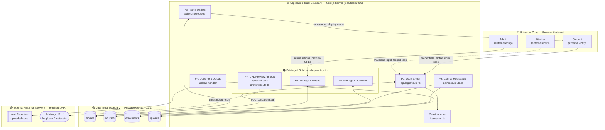

# IFT 542 — Task 1: STRIDE Threat Model & Risk Assessment (14 marks)

**Application:** Student Registration Web Application (Next.js 14 + PostgreSQL, localhost prototype)
**Scope:** login, profile update, course registration, document upload, admin course management, admin enrolment management.
**Note:** every threat below is tied to an actual planted vulnerability with its file path, so the model reflects the real code, not textbook generics.

---

## 1. Data-Flow Diagram with Trust Boundaries (Evidence item 6)

The Mermaid source is below; a rendered copy is committed at `evidence/task1/dfd.png` (regenerated locally with `@mermaid-js/mermaid-cli`) and embedded immediately beneath it.

**Trust boundaries marked:** (1) browser ↔ server, (2) server ↔ database, (3) server ↔ external/internal network via URL-preview, (4) server ↔ local filesystem, and (5) a privilege sub-boundary between ordinary and admin functions. The red dotted flows are the attacker's entry points.

---

## 2. STRIDE Worksheet (Evidence item 7 — ≥6 threats, ≥1 per category)

| # | STRIDE | Application-specific threat | Planted vulnerability (file : line) |
|---|--------|------------------------------|--------------------------------------|
| T1 | **S**poofing | Authenticate as any user (incl. admin) with no valid password by injecting into the login query | SQLi — `src/app/api/login/route.ts:46–54` |
| T2 | **T**ampering | Force a logged-in victim's browser to submit profile updates / course enrolments via a forged cross-site request | No CSRF + no SameSite — `api/profile/route.ts:27`, `api/enrol/route.ts:23`, `lib/session.ts:60` |
| T3 | **T**ampering / EoP | Stored script in the display name executes in any viewer's (incl. admin's) session, hijacking it or forging privileged actions | Stored XSS — source `api/profile/route.ts:32`, sinks `dashboard/page.tsx:23`, `profile/page.tsx:25` |
| T4 | **R**epudiation | An admin (or attacker acting as admin) removes an enrolment or changes records; no tamper-evident audit log exists, so the action cannot be attributed or disproven | No security logging in baseline (added only in Task 3) |
| T5 | **I**nformation Disclosure | Whole-database password compromise, since credentials are stored and compared in cleartext and are exfiltratable through T1 | Plaintext passwords — `db/migrations/001_init.sql:29`, `db/seed.sql:26–34`, compared `api/login/route.ts:50` |
| T6 | **I**nformation Disclosure | Server-side request forgery reaches loopback / private / cloud-metadata addresses and returns internal responses | SSRF — `src/app/api/admin/url-preview/route.ts:27` |
| T7 | **I**nformation Disclosure | Verbose SQL/stack errors and distinct "no account" vs "wrong password" responses leak schema and valid accounts | Verbose errors `api/login/route.ts:56`; enumeration `api/login/route.ts:86` |
| T8 | **D**enial of Service | Unthrottled login and unbounded document upload allow request/large-file flooding and unlimited brute force | No rate limiting `api/login/route.ts:28`; upload handler (no size cap) |
| T9 | **E**levation of Privilege | Ordinary user becomes admin by using the default admin credentials or forging a session with the committed hardcoded secret | Default admin `lib/config.ts:26`, `db/seed.sql:8`; hardcoded secret `lib/config.ts:16`; session fixation `lib/session.ts:35` |

All six STRIDE categories are covered (S:T1 · T:T2,T3 · R:T4 · I:T5,T6,T7 · D:T8 · E:T9).

---

## 3. Risk Register (Evidence item 8)

Likelihood (L) and Impact (I) on 1–5; **Risk = L × I**; ranked; control type in brackets; residual after the planned Task 2/3 fixes.

| Rank | # | STRIDE | Threat | L | I | Risk | Priority | Control (P=preventive, D=detective, C=corrective) | Residual (L×I) |
|------|----|--------|--------|---|---|------|----------|--------|----------|
| 1 | T1 | S | SQLi auth bypass | 5 | 5 | **25** | Critical | Parameterized queries **(P)**; input validation **(P)**; log rejected/anomalous queries **(D)**; session revocation + runbook **(C)** | 1×5 = **5** |
| 2 | T9 | E | Default admin creds + hardcoded secret → privilege escalation | 4 | 5 | **20** | Critical | Remove default account, force strong seeded password, secret to env + rotate **(P)**; MFA for admin **(P)**; log denied-authorization **(D)**; invalidate sessions on leak **(C)** | 1×5 = **5** |
| 3 | T5 | I | Plaintext password disclosure (via DB read / T1) | 4 | 5 | **20** | Critical | Argon2id hashing, never return plaintext **(P)**; monitor bulk DB reads **(D)**; forced reset on suspected breach **(C)** | 2×3 = **6** |
| 4 | T3 | T/E | Stored XSS in display name | 4 | 4 | **16** | High | Contextual output encoding + restrictive CSP **(P)**; CSP report-uri **(D)** | 1×4 = **4** |
| 5 | T2 | T | CSRF on profile / enrolment | 4 | 3 | **12** | High | Anti-CSRF token + SameSite cookie **(P)** | 1×3 = **3** |
| 6 | T8 | D | Login/upload flooding & brute force | 4 | 3 | **12** | High | Rate limiting + temporary lockout + upload size cap **(P)**; alert on repeated failures **(D)** | 2×3 = **6** |
| 7 | T4 | R | Unattributable admin/user actions | 4 | 3 | **12** | High | Structured who/what/when audit logs **(D)**; append-only retention **(C)** | 2×2 = **4** |
| 8 | T6 | I | SSRF via admin URL preview | 3 | 4 | **12** | High | Destination allowlist; reject loopback/private/metadata; re-check after DNS **(P)** | 1×3 = **3** |
| 9 | T7 | I | Verbose errors + user enumeration | 5 | 2 | **10** | Medium | Generic errors, debug off **(P)**; monitor error rates **(D)** | 1×2 = **2** |

---

## 4. Justification for the Top-Three Risks (Evidence item 9)

**#1 — T1, SQLi authentication bypass (25).** This is the single highest risk because it is unauthenticated, trivially exploitable (already demonstrated logging in as `ada.learner` with no valid password), and grants complete account takeover including the admin account — collapsing every other control. Likelihood is maximal (the concatenated query at `login/route.ts:46–54` accepts attacker-controlled SQL directly) and impact is maximal (full data and privilege compromise). **Residual 5:** after parameterized binding, user input can no longer alter query structure, so likelihood drops to 1; the residual reflects only the possibility of an unrelated future injection elsewhere, which is monitored and accepted as low.

**#2 — T9, privilege escalation via default admin + hardcoded secret (20).** Any user who knows the shipped default (`admin@campus.local / admin123`) or the committed session secret (`lib/config.ts:16`) can reach admin course/enrolment management, which is a full trust-boundary crossing. Likelihood is high because both values are discoverable in source or documentation; impact is maximal (administrative control). **Residual 5:** removing the default account, forcing a strong per-deployment password, moving the secret to an environment variable and rotating it makes guessing or forgery infeasible, so likelihood drops to 1. The remaining residual is generic credential-theft risk, further reduced by admin MFA, and is accepted as low.

**#3 — T5, plaintext password disclosure (20).** Credentials are stored and compared in cleartext (`001_init.sql:29`, `seed.sql:26–34`, `login/route.ts:50`) and are exfiltratable through T1, meaning one read compromises every account and any password reused elsewhere. Likelihood is high given T1; impact is maximal (mass credential compromise with downstream reuse). **Residual 6:** Argon2id hashing means that even a full database read yields only expensive-to-crack hashes; the residual reflects offline cracking of weak passwords, mitigated by a password policy and accepted as low.

---

## Appendix A — OWASP Top 10 (2021) mapping

This appendix folds in the OWASP Top-10 (2021) view (originally drafted in `report/threat-model.md`)
so the two documents agree. **STRIDE (§2) and the risk register (§3) remain the primary model;** this
is a cross-reference that ties every *planted* vulnerability to its STRIDE threat ID and risk-register
rank. File:line references match §2 exactly.

| Planted vulnerability | File : line | STRIDE | Risk # | OWASP 2021 |
|---|---|---|---|---|
| SQL injection in login (concatenated `sql.unsafe`) | `api/login/route.ts:46–54` | T1 | 1 | A03 Injection |
| Plaintext password storage & compare | `001_init.sql:29`, `seed.sql:26–34`, `login/route.ts:50` | T5 | 3 | A02 Cryptographic Failures |
| Verbose DB/stack errors to client | `api/login/route.ts:56` (also :92) | T7 | 9 | A05 Security Misconfiguration |
| User enumeration / field disclosure | `api/login/route.ts:86` | T7 | 9 | A07 Identification & Auth Failures |
| No rate limiting on login | `api/login/route.ts:28` | T8 | 6 | A07 Identification & Auth Failures |
| No session-id regeneration (fixation) | `lib/session.ts:35`; used `login/route.ts:70` | T9 | 2 | A07 Identification & Auth Failures |
| Stored XSS (display name) | source `api/profile/route.ts:32`; sinks `dashboard/page.tsx:23`, `profile/page.tsx:25` | T3 | 4 | A03 Injection (XSS) |
| No CSRF on state-changing POSTs | `api/profile/route.ts:27`, `api/enrol/route.ts:23` | T2 | 5 | A01 Broken Access Control |
| No SameSite on session cookie (enables CSRF) | `lib/session.ts:60` | T2 | 5 | A05 Security Misconfiguration |
| SSRF in admin URL preview | `api/admin/url-preview/route.ts:27` | T6 | 8 | A10 Server-Side Request Forgery |
| Debug mode on (drives verbose errors) | `lib/config.ts:11` | T7 | 9 | A05 Security Misconfiguration |
| Hardcoded session secret (committed fallback) | `lib/config.ts:16` | T9 | 2 | A05 / A02 |
| Default admin with well-known password | `lib/config.ts:26`, `seed.sql:8` | T9 | 2 | A07 Identification & Auth Failures |

**OWASP categories represented:** A01, A02, A03, A05, A07, A10 (2021).

**Note on T4:** the repudiation threat (no tamper-evident audit log) is an *absence of control*, not a
planted code sink, so it has no `file:line` row above; it corresponds to OWASP **A09 Security Logging &
Monitoring Failures**.

---

### Coverage & consistency checklist for this task
- [x] DFD exported to `evidence/task1/dfd.png` and referenced in the report
- [x] All six STRIDE categories present (they are: S,T,R,I,D,E)
- [x] ≥6 threats in worksheet (9 here) — every one tied to a real file path
- [x] Risk register shows L, I, Score, Priority, Control, Residual for every row
- [x] Risk = L × I arithmetic correct in every row
- [x] Residual < initial for every mitigated threat, with reasoning
- [x] Top-3 justification written (above)
- [x] Reconcile with Claude Code's `report/threat-model.md` (merge the OWASP mapping in as an appendix so the two documents agree)
